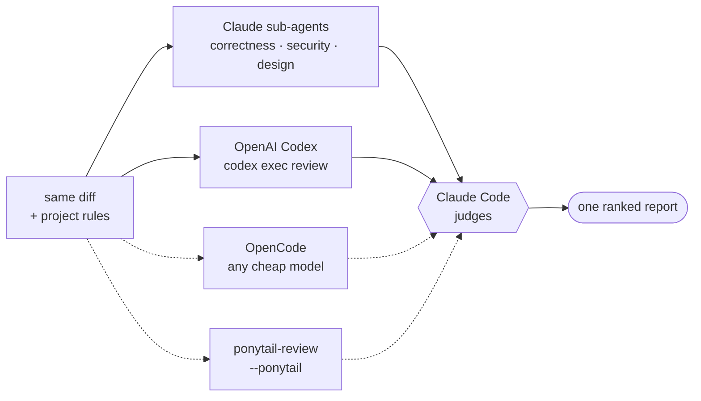

# Multi Code Review (`mcr`)

[Русская версия →](README.ru.md) · [中文 →](README.zh.md)

## Human Readable

soo basically its is what name implies - multi code-review. it adds two more layers (on top of Claude's code review) to you code reviews:
1. Codex - chatgpt is very good at coed-review. you need to have installed codex cli
2. (optional) opencode - by default its DeepSeek V4 Flash (said to be good at bug-hunting). Need OpenCode Go tho, but you can try with free models (or even with good ones like Kimi K3 and etc)
3. (optional) [ponytail](https://github.com/DietrichGebert/ponytail) review for overengeneering. just read ponytail plugin desc, its kinda cool

install
```bash
claude plugin marketplace add szarkans/multi-code-review
claude plugin install mcr@szarkans-skills

or
npx skills add szarkans/multi-code-review

or
git clone https://github.com/szarkans/multi-code-review ~/.claude/skills/mcr
```

then restart claude code and `/mcr:multi-review [args]` should do the trick. happy building!

---

## Totally not AI-generated README

> Three models review the same diff with the same project rules. Claude Code
> judges their findings into one ranked report.

One model reviewing your code invents problems that aren't there and walks past
ones that are. Independent models disagree — and the disagreement is the useful
part. `mcr` runs up to three reviewers over an identical diff, checks every
finding only one of them raised, drops what doesn't survive, and hands you one
report ordered by what actually matters.



Solid lines are always there; dashed ones are optional and skipped when absent.

The reviewers **propose**. They don't vote and they don't get the last word —
Claude Code reads the cited code and decides. Two of the three are cheap and
external, so your Claude budget goes into judging rather than reading.

### What makes it different from a single-model review

- **Every reviewer gets the project's rules.** `CLAUDE.md`, `AGENTS.md`, and the
  `.claude/rules/*.md` files matching the changed paths are collected and
  injected into all three. External reviewers that don't know your conventions
  spend their findings re-litigating settled decisions; these ones don't.
- **Findings only one reviewer raised get checked** against the real code
  before you see them — the cited lines are opened, the guard is looked for, and
  `git` decides whether the problem is new or pre-existing.
- **Disagreements are surfaced, not averaged.** Where good reviewers split is
  where you should look.
- **Missing reviewers degrade honestly.** An absent backend is named in the
  report, never silently dropped.

### Install

| method | what you get | command |
|---|---|---|
| Claude Code marketplace | skill + review sub-agents | `claude plugin marketplace add szarkans/multi-code-review` then `claude plugin install mcr@szarkans-skills` |
| [`npx skills`](https://github.com/vercel-labs/skills) | skill + scripts only | `npx skills add szarkans/multi-code-review` |
| git clone | skill + review sub-agents, auto-loads, easiest to modify | `git clone https://github.com/szarkans/multi-code-review ~/.claude/skills/mcr` |

The sub-agents are a plugin-level component, so the `npx skills` route falls
back to generic sub-agents for the Claude side. Everything else — the probe,
Codex, OpenCode, the project-rule injection, the judging — works identically,
because the scripts ship inside the skill.

### Requirements

| | | |
|---|---|---|
| **Claude Code** | required | The judge and the sub-agent reviewers. |
| **[OpenAI Codex CLI](https://github.com/openai/codex)** | **required** | The second model. Must be installed and logged in (`codex login`). Without it there is no multi-model review, and the skill stops instead of pretending. |
| **[OpenCode](https://opencode.ai)** | optional | The third reviewer slot — any model you have. Missing or broken → skipped with a note. |
| **[ponytail](https://github.com/DietrichGebert/ponytail)** | optional | A fourth *lens*, not a fourth reviewer: `ponytail-review` hunts over-engineering only. Its findings get their own section and never mix with defect findings. |
| **Good mood**| required | be happy eh? |

Availability is probed by a shell script whose output is injected into the
skill before the model reads it, so the check costs zero tokens and stores no
state.

### Usage

```
/mcr:multi-review                    # normal mode, uncommitted changes
/mcr:multi-review quick              # cheapest pass — external reviewers only
/mcr:multi-review ultra              # everything, plus per-finding verification
/mcr:multi-review branch main        # this branch against main
/mcr:multi-review commit a1b2c3d     # one commit
```

Installed via `npx skills`, it is `/multi-review`.

**Everything after the command is free text, and the leftover is an instruction
to the reviewers.** A handful of tokens are recognised and pulled out; whatever
remains goes to all three reviewers verbatim, and gets answered at the top of
the report.

```
/mcr:multi-review проверь миграции, там точно race
/mcr:multi-review ultra is the retry idempotent? what happens on a double webhook
/mcr:multi-review high только про безопасность
/mcr:multi-review check src/auth.py and src/session.py
```

Name real files or directories and the diff itself is narrowed to them, so
every reviewer and the project-rule collection agree on the same smaller range.

Recognised tokens, all optional and matched by value rather than position:

| | |
|---|---|
| `haiku` `sonnet` `opus` `fable` | model for the Claude review sub-agents |
| `low` `medium` `high` `xhigh` `max` | Codex reasoning effort |
| `--ponytail` | add the over-engineering lens |
| `quick` `normal` `ultra` | depth |

```
/mcr:multi-review opus max ultra --ponytail
```

Claude also reaches for it on its own when you ask for a review, a second
opinion, or a cross-check before a PR.

#### Modes

| mode | reviewers | cost |
|---|---|---|
| `quick` | Codex (`low`) + OpenCode | Cheapest. No Claude sub-agents at all — less of your budget than a plain single-model review. |
| `normal` *(default)* | Codex (`medium`) + OpenCode + correctness and security sub-agents | The PR pass. |
| `ultra` | Codex (`high`) + an adversarial second Codex pass + OpenCode + correctness, security and design sub-agents, every surviving finding independently verified | Minutes and real money. Ask for it deliberately. |

`--ponytail` adds the simplicity lens to any mode. It is never automatic: it
answers a different question than the rest of the pipeline, so it gets its own
report section and never mixes with defect findings.

> If ponytail mode is active, its `SubagentStart` hook injects the YAGNI ruleset
> into *every* sub-agent, including the ones hunting bugs. Set
> `PONYTAIL_SUBAGENT_MATCHER` to a regex that does not match `mcr-` to keep the
> defect reviewers unbiased.

#### Configuration

| variable | effect |
|---|---|
| `MCR_OPENCODE_MODEL` | Pin the third reviewer's model, e.g. `opencode/deepseek-v4-flash-free`. |
| `MCR_OPENCODE_CANDIDATES` | Space-separated models to auto-pick from when the above is unset. |
| `MCR_CONTEXT_MAX_BYTES` | Cap on the injected project rules (default 24000). |
| `MCR_REVIEWER_MODEL` | Model for the Claude review sub-agents. Default Sonnet — a fleet of reviewers is the wrong place to spend the expensive model, and depth pays off in the judging. No mode raises it on its own. |

Report-only by default: no edits, no commits, no PR comments. An opt-in loop
mode fixes and re-reviews until nothing new comes back, capped at three rounds.

### Evaluating it

`evals/` holds a recall harness. Each case names a real fix-commit; the runner
checks the repo out at that commit, reverts the fix in source files only — so
the diff under review is *the bug being introduced*, with tests and docs left
at their fixed state — and runs the external reviewers over it.

```bash
evals/run.sh --repo ~/dev/some-repo --out /tmp/mcr-eval
```

Grading is deliberately not automated: "did it find *this* bug" is a judgement
a substring match gets wrong in both directions.

Known limitation of this method: reverting a fix shows the reviewer a guard
being **removed**, which is easier to spot than a guard that was never written.
Treat a high score here as proof the pipeline works, not as a measure of how
these models do on fresh code.

## License

MIT © Sergei Shatrov
