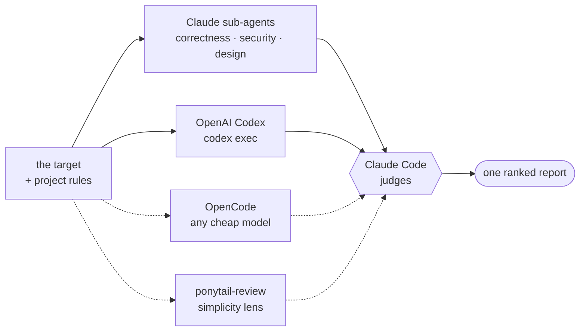

# Multi (`multi`)

[Русская версия →](README.ru.md) · [中文 →](README.zh.md)

Several models on the same question at once, instead of trusting one.

| command | what it does |
|---|---|
| `/multi:code-review` | code review by Claude sub-agents + Codex + OpenCode, judged into one report |
| `/multi:check-if-done` | is the work actually finished, or only finished-looking — every claim backed by a command that was really run |
| `/multi:ask` | put one question to all of them and see the three answers side by side |

## Human Readable

soo basically its what the name implies - several models instead of one. three commands:

1. `/multi:code-review` - the original one. adds two more layers on top of Claude's own review:
   Codex (chatgpt is very good at code-review, needs codex cli installed), optional opencode
   (by default DeepSeek V4 Flash, said to be good at bug-hunting - needs OpenCode Go, but free
   models work too), and optional [ponytail](https://github.com/DietrichGebert/ponytail) lens
   for overengineering. just read ponytail plugin desc, its kinda cool
2. `/multi:check-if-done` - the "no bro is it REALLY done" one. a model that just wrote the code
   is the worst judge of whether it works, so this asks models that didn't write it, and refuses
   to call anything done without actually running a command that proves it
3. `/multi:ask` - just ask everyone the same thing and see three answers. no judging, no merging

you can point code-review at whatever you want, not just a diff: `/multi:code-review src/auth.py`,
`/multi:code-review the legacy billing module`, `/multi:code-review this branch against main`,
or just plain words like `/multi:code-review check the migrations, i'm sure there's a race`.
no arguments = whatever we were just working on.

install
```bash
claude plugin marketplace add szarkans/multi-code-review
claude plugin install multi@szarkans-skills

or
npx skills add szarkans/multi-code-review

or
git clone https://github.com/szarkans/multi-code-review ~/.claude/skills/multi
```

then restart claude code and `/multi:code-review [args]` should do the trick. happy building!

---

## Totally not AI-generated README

> Several models look at the same thing with the same project rules. Claude Code
> judges what comes back into one report.

One model reviewing your code invents problems that aren't there and walks past
ones that are. One model checking its own work grades a memory of what it meant
to do. Independent models disagree — and the disagreement is the useful part.

Codex, OpenCode and the ponytail lens cost nothing per run, so they always start
immediately and in parallel. How much Claude gets spent on top is decided
*after* they report — on what they actually found, not on a guess made up front.

## `/multi:code-review`

`multi` points up to three reviewers at the same target, checks every finding
only one of them raised, drops what doesn't survive, and hands you one report
ordered by what actually matters.

**It reviews whatever you name** — a diff, a branch, two files, one function, a
legacy module nobody has touched in years, the whole repo. With no arguments it
reviews the work you just did; the diff is only the fallback for when there is
nothing better to go on.



Dashed lines are the reviewers that get skipped when they aren't installed.

The reviewers **propose**. They don't vote and they don't get the last word —
Claude Code reads the cited code and decides. Two of the three are cheap and
external, so your Claude budget goes into judging rather than reading.

### What makes it different from a single-model review

- **Every reviewer gets the project's rules.** `CLAUDE.md`, `AGENTS.md`, and the
  `.claude/rules/*.md` files matching the changed paths are collected and
  injected into all three. External reviewers that don't know your conventions
  spend their findings re-litigating settled decisions; these ones don't.
- **Findings only one reviewer raised get checked** against the real code
  before you see them — the cited lines are opened and the guard is looked for.
- **Small defects survive, matters of taste don't.** A wrong id in a log line
  ships at `LOW`; formatting and naming never ship at all, because the ponytail
  lens runs alongside and owns that ground.
- **Disagreements are surfaced, not averaged.** Where good reviewers split is
  where you should look.
- **Missing reviewers degrade honestly.** An absent backend is named in the
  report, never silently dropped.

### Usage

```
/multi:code-review                              # the work you just did
/multi:code-review src/auth.py src/session.py   # two files, no diff involved
/multi:code-review the legacy billing module    # old code, all of it in scope
/multi:code-review this branch against main     # a change review
/multi:code-review ultra                        # did the task actually get done?
```

Installed via `npx skills`, it is `/code-review`.

**Everything after the command is free text, and the leftover is an instruction
to the reviewers.** A handful of tokens are recognised and pulled out; whatever
remains goes to all three reviewers verbatim, and gets answered at the top of
the report.

```
/multi:code-review проверь миграции, там точно race
/multi:code-review ultra is the retry idempotent? what happens on a double webhook
/multi:code-review high только про безопасность
/multi:code-review check src/auth.py and src/session.py
```

Name real files or directories and the review is narrowed to them, so
every reviewer and the project-rule collection agree on the same smaller range.

Recognised tokens, all optional and matched by value rather than position:

| | |
|---|---|
| `haiku` `sonnet` `opus` `fable` | model for the Claude review sub-agents |
| `low` `medium` `high` `xhigh` `max` | Codex reasoning effort |
| `lite` `normal` `ultra` | depth |

```
/multi:code-review opus max ultra
```

Naming a mode skips the escalation step and goes straight there.

Claude also reaches for it on its own when you ask for a review, a second
opinion, or a cross-check before a PR.

### Modes

Codex, OpenCode and ponytail run in every mode — they're free, so there's
nothing to save by holding them back. The mode only says how much **Claude**
gets spent on top, and it isn't chosen up front: the free reviewers report
first, and the depth follows from what they found.

| mode | Claude sub-agents | when |
|---|---|---|
| `lite` | correctness | small, low-risk, and the free reviewers agree there's little there |
| `normal` *(default)* | correctness · security · design | anything heading for a PR |
| `ultra` | those three, plus **execution**, plus an adversarial second Codex pass, plus one verifier per single-source finding | expensive to get wrong |

`ultra` isn't a deeper code review — it reviews whether **the task actually got
done**. If that is the question you have, `/multi:check-if-done` is the command
that only asks it, and asks it harder.

> If ponytail mode is active, its `SubagentStart` hook injects the YAGNI ruleset
> into *every* sub-agent, including the ones hunting bugs. Set
> `PONYTAIL_SUBAGENT_MATCHER` to a regex that does not match the review agents to
> keep them unbiased.

## `/multi:check-if-done`

A model that just wrote code is the worst possible judge of whether that code
works. It compares the task to its own summary of what it did, the two match,
and it says done. Nothing was verified — the check was a memory of an intention.

Two things fix that, and this command does both:

- **Someone who didn't write it looks at it** — Codex, OpenCode, and a sub-agent
  that has never seen the conversation.
- **Nothing is called done without an executed command behind it.** Not "the
  tests should pass" — the command, its output, its exit code.

It needs both sides of a comparison, so it starts by finding what was promised:
a plan file or an issue you name, otherwise what this session set out to do.
With neither, it says so and stops, rather than quietly turning into a code
review that nobody asked for.

```
/multi:check-if-done                      # what we did this session
/multi:check-if-done docs/plan.md         # against a written plan
/multi:check-if-done the auth refactor from the ticket
```

Every promised item lands in exactly one bucket:

| | |
|---|---|
| ❌ **Not done** | and the evidence that shows it |
| 🟡 **Half done** | what works, what doesn't |
| 🔍 **Unverifiable** | nothing runnable proves this — a finding in itself |
| ✅ **Verified working** | the command that ran, and what it actually printed |

**An item with no executed evidence never lands in "Verified working"**, however
obviously correct it looks. That one line is the whole command: it is the
difference between *"I read the code and it looks right"* and *"I ran it."*

Editing code to make a check pass is forbidden while this runs — that is the one
move that turns a completion check into a lie.

## `/multi:ask`

One model's answer is one model's priors. This puts your question to Claude,
Codex and OpenCode at the same time and shows the three answers side by side.

```
/multi:ask is a channel or a mutex better here?
/multi:ask what's the least awful way to version this API?
```

No judging and no merging. Picking a winner throws away the only thing you came
for, so the answers stay recognisably their own — and the question goes out
**exactly as you asked it**, word for word, because the point is what different
models do with the same words. One short section at the end says where they
actually disagreed.

If all three said the same thing, that's an answer too: the question wasn't as
open as it looked.

## Install

| method | what you get | command |
|---|---|---|
| Claude Code marketplace | skills + review sub-agents | `claude plugin marketplace add szarkans/multi-code-review` then `claude plugin install multi@szarkans-skills` |
| [`npx skills`](https://github.com/vercel-labs/skills) | skills + scripts only | `npx skills add szarkans/multi-code-review` |
| git clone | skills + review sub-agents, auto-loads, easiest to modify | `git clone https://github.com/szarkans/multi-code-review ~/.claude/skills/multi` |

The sub-agents are a plugin-level component, so the `npx skills` route falls
back to generic sub-agents for the Claude side. Everything else — the probe,
Codex, OpenCode, the project-rule injection, the judging — works identically,
because the scripts ship inside the plugin.

## Requirements

| | | |
|---|---|---|
| **Claude Code** | required | The judge and the sub-agent reviewers. |
| **[OpenAI Codex CLI](https://github.com/openai/codex)** | **required** | The second model, in all three commands. Must be installed and logged in (`codex login`). Without it there is no multi-model anything, and the skills stop instead of pretending. |
| **[OpenCode](https://opencode.ai)** | optional | The third slot — any model you have. Missing or broken → skipped with a note. |
| **[ponytail](https://github.com/DietrichGebert/ponytail)** | recommended | A *lens*, not a fourth reviewer: `ponytail-review` hunts over-engineering only, and runs on every `code-review` when installed. It owns matters of taste, which is exactly why the defect reviewers are told to stay out of them. Its findings get their own section and never mix with bugs. |
| **Good mood**| required | be happy eh? |

Availability is probed by a shell script whose output is injected into the skill
before the model reads it, so the check costs zero tokens and stores no state.

## Configuration

| variable | effect |
|---|---|
| `MULTI_OPENCODE_MODEL` | Pin the third model, e.g. `opencode/deepseek-v4-flash-free`. Used by all three commands. |
| `MULTI_OPENCODE_CANDIDATES` | Space-separated models to auto-pick from when the above is unset. |
| `MULTI_CONTEXT_MAX_BYTES` | Cap on the injected project rules (default 24000). |
| `MULTI_REVIEWER_MODEL` | Model for the Claude review sub-agents. Default Sonnet — a fleet of reviewers is the wrong place to spend the expensive model, and depth pays off in the judging. No mode raises it on its own. |

Report-only by default: no edits, no commits, no PR comments. `code-review` has
an opt-in loop mode that fixes and re-reviews until nothing new comes back,
capped at three rounds.

## Evaluating it

`evals/` holds a recall harness for `code-review`. Each case names a real
fix-commit; the runner checks the repo out at that commit, reverts the fix in
source files only — so the diff under review is *the bug being introduced*, with
tests and docs left at their fixed state — and runs the external reviewers over
it.

```bash
evals/run.sh --repo ~/dev/some-repo --out /tmp/multi-eval
```

Grading is deliberately not automated: "did it find *this* bug" is a judgement
a substring match gets wrong in both directions.

Known limitation of this method: reverting a fix shows the reviewer a guard
being **removed**, which is easier to spot than a guard that was never written.
Treat a high score here as proof the pipeline works, not as a measure of how
these models do on fresh code.

## License

MIT © Sergei Shatrov
