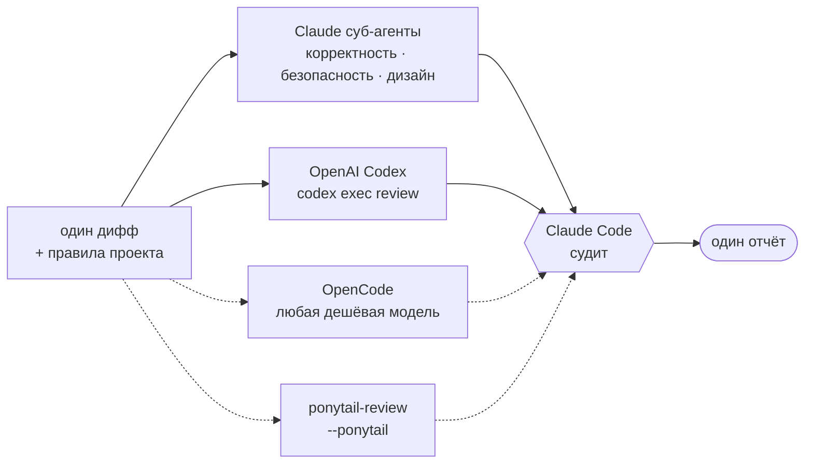

# Multi Code Review (`mcr`)

[English version →](README.md) · [中文 →](README.zh.md)

## Человеческим языком

мульти код-ревью - добавляет к Клодовскому код-ревью также ТРИ новых слоя:  
1. кодекс - основа, база. он хороший ревьювер. без него у плагина смысла ноль
2. opencode - если скачан. нативно стоит deepseek v4 flash, но можно на фришные
3. опциональная линза [ponytail](https://github.com/DietrichGebert/ponytail) на переусложнение кода

запуск `/mcr:multi-review [модель суб-агента claude] [effort Codex] [--ponytail если хочешь линзу понитейла]`

а ещё можно просто писать словами что проверить:
`/mcr:multi-review проверь миграции, там точно race` текст уходит всем троим
ревьюверам как есть, и ответ на него идёт первым в отчёте. назовёшь конкретные
файлы — дифф сузится до них

скачять:
```bash
claude plugin marketplace add szarkans/multi-code-review
claude plugin install mcr@szarkans-skills

# ИЛИ
npx skills add szarkans/multi-code-review

# ИЛИ
git clone https://github.com/szarkans/multi-code-review ~/.claude/skills/mcr
```

всё давай удачи

---

## AI Generated README

> Три модели читают один и тот же дифф с одними и теми же правилами проекта.
> Claude Code сводит их находки в один отчёт.

Одна модель на ревью выдумывает проблемы, которых нет, и проходит мимо тех,
которые есть. Независимые модели расходятся — и расхождение как раз и есть
самое полезное. `mcr` запускает до трёх ревьюверов по одному и тому же диффу,
проверяет каждую находку, которую поднял только кто-то один, выбрасывает то,
что не подтвердилось, и отдаёт один отчёт, отсортированный по важности.



Сплошные линии есть всегда, пунктирные — необязательные, при отсутствии просто
пропускаются.

Ревьюверы **предлагают**. Они не голосуют и не решают — Claude Code открывает
процитированный код и решает сам. Двое из трёх дешёвые и внешние, поэтому твой
бюджет Claude уходит на суждение, а не на чтение.

### Чем это отличается от обычного ревью одной моделью

- **Правила проекта получают все ревьюверы.** `CLAUDE.md`, `AGENTS.md` и те
  файлы из `.claude/rules/*.md`, чьи имена совпадают с изменёнными путями,
  собираются и вклеиваются всем троим. Внешний ревьювер, который не знает твоих
  договорённостей, тратит находки на их пересмотр — этот не тратит.
- **Находки, которые поднял только один**, проверяются по живому коду до того,
  как ты их увидишь: открываются процитированные строки, ищется недостающая
  проверка, а `git` решает, новая это проблема или была всегда.
- **Расхождения выносятся наверх, а не усредняются.** Там, где хорошие
  ревьюверы разошлись, и надо смотреть.
- **Отсутствующий ревьювер называется честно** — он не исчезает молча.

### Установка

| способ | что получаешь | команда |
|---|---|---|
| маркетплейс Claude Code | скилл + суб-агенты | `claude plugin marketplace add szarkans/multi-code-review`, затем `claude plugin install mcr@szarkans-skills` |
| [`npx skills`](https://github.com/vercel-labs/skills) | только скилл и скрипты | `npx skills add szarkans/multi-code-review` |
| git clone | скилл + суб-агенты, подхватывается сам, проще всего править | `git clone https://github.com/szarkans/multi-code-review ~/.claude/skills/mcr` |

Суб-агенты — компонент уровня плагина, поэтому через `npx skills` сторона
Claude откатывается на обычных суб-агентов. Всё остальное — проба, Codex,
OpenCode, вклейка правил проекта, судейство — работает одинаково, потому что
скрипты лежат внутри самого скилла.

### Что нужно

| | | |
|---|---|---|
| **Claude Code** | обязательно | Судья и суб-агенты-ревьюверы. |
| **[OpenAI Codex CLI](https://github.com/openai/codex)** | **обязательно** | Вторая модель. Должен стоять и быть залогинен (`codex login`). Без него это не мульти-ревью, и скилл честно останавливается, а не притворяется. |
| **[OpenCode](https://opencode.ai)** | по желанию | Третий слот — любая твоя модель. Нет или сломан → пропускается с пометкой. |
| **[ponytail](https://github.com/DietrichGebert/ponytail)** | по желанию | Четвёртая *линза*, а не четвёртый ревьювер: `ponytail-review` ищет только переусложнение. Его находки идут отдельной секцией и никогда не смешиваются с багами. |

Наличие проверяет shell-скрипт, вывод которого подставляется в скилл до того,
как модель его прочитает. Проверка стоит ноль токенов и ничего не хранит.

### Как пользоваться

```
/mcr:multi-review                    # обычный режим, незакоммиченные изменения
/mcr:multi-review quick              # самый дешёвый проход — только внешние ревьюверы
/mcr:multi-review ultra              # всё сразу, с проверкой каждой находки
/mcr:multi-review branch main        # ветка против main
/mcr:multi-review commit a1b2c3d     # один коммит
```

После установки через `npx skills` команда называется `/multi-review`.

**Всё, что идёт после команды — свободный текст, и остаток от него это
инструкция ревьюверам.** Несколько токенов опознаются и вынимаются, остальное
уходит всем трём дословно и получает ответ в начале отчёта.

```
/mcr:multi-review проверь миграции, там точно race
/mcr:multi-review ultra идемпотентен ли ретрай, что будет на дубле вебхука
/mcr:multi-review high только про безопасность
/mcr:multi-review проверь src/auth.py и src/session.py
```

Назовёшь реальные файлы или каталоги — дифф сузится до них, и тогда все
ревьюверы и сборка правил проекта смотрят на один и тот же меньший кусок.

Опознаваемые токены, все необязательные, по значению, а не по позиции:

| | |
|---|---|
| `haiku` `sonnet` `opus` `fable` | модель для суб-агентов Claude |
| `low` `medium` `high` `xhigh` `max` | ризонинг-эффорт Codex |
| `--ponytail` | добавить линзу на переусложнение |
| `quick` `normal` `ultra` | глубина |

```
/mcr:multi-review opus max ultra --ponytail
```

Claude берёт скилл и сам, когда просишь ревью, второе мнение или проверку
перед PR.

#### Режимы

| режим | ревьюверы | цена |
|---|---|---|
| `quick` | Codex (`low`) + OpenCode | Дешевле всего. Суб-агентов Claude нет вообще — тратит меньше твоего бюджета, чем обычное одномодельное ревью. |
| `normal` *(по умолчанию)* | Codex (`medium`) + OpenCode + суб-агенты на корректность и безопасность | Проход перед PR. |
| `ultra` | Codex (`high`) + второй, adversarial проход Codex + OpenCode + суб-агенты на корректность, безопасность и дизайн, каждая выжившая находка проверяется отдельно | Минуты и реальные деньги. Включать осознанно. |

`--ponytail` добавляет линзу на простоту к любому режиму. Автоматически она не
включается никогда: она отвечает на другой вопрос, поэтому идёт отдельной
секцией и не смешивается с находками про дефекты.

> Если режим ponytail включён, его хук `SubagentStart` вливает правила YAGNI во
> *все* суб-агенты, включая тех, кто ищет баги. Задай `PONYTAIL_SUBAGENT_MATCHER`
> регуляркой, которая не совпадает с `mcr-`, чтобы ревьюверы на дефекты остались
> непредвзятыми.

#### Настройка

| переменная | что делает |
|---|---|
| `MCR_OPENCODE_MODEL` | Жёстко задать модель третьего ревьювера, например `opencode/deepseek-v4-flash-free`. |
| `MCR_OPENCODE_CANDIDATES` | Список моделей через пробел, из которых выбрать автоматически, если предыдущая не задана. |
| `MCR_CONTEXT_MAX_BYTES` | Потолок на объём вклеиваемых правил (по умолчанию 24000). |
| `MCR_REVIEWER_MODEL` | Модель для суб-агентов Claude. По умолчанию Sonnet — стая ревьюверов не то место, куда стоит вкладывать дорогую модель, глубина окупается в судействе. Ни один режим не поднимает её сам. |

По умолчанию только отчёт: ничего не правится, не коммитится, комментарии в PR
не пишутся. Есть режим цикла — правит и перепроверяет, пока не перестанет
находить новое, максимум три круга.

### Как это измерять

В `evals/` лежит стенд на полноту находок. Каждый кейс называет реальный
fix-коммит; раннер выкладывает репо на этот коммит, откатывает фикс **только в
исходниках** — так что дифф на ревью это *внесение бага*, а тесты и документация
остаются починенными и в дифф не попадают — и прогоняет по нему внешних
ревьюверов.

```bash
evals/run.sh --repo ~/dev/some-repo --out /tmp/mcr-eval
```

Оценка намеренно не автоматическая: «нашёл ли он *именно этот* баг» — вопрос
суждения, и поиск по подстроке ошибается в обе стороны.

Известное ограничение метода: откат фикса показывает ревьюверу **удаление**
защиты, а это заметно проще, чем недостающая проверка в свеженаписанном коде.
Высокий результат тут доказывает, что труба работает, но не измеряет, как эти
модели справляются со свежим кодом.

## Лицензия

MIT © Sergei Shatrov
