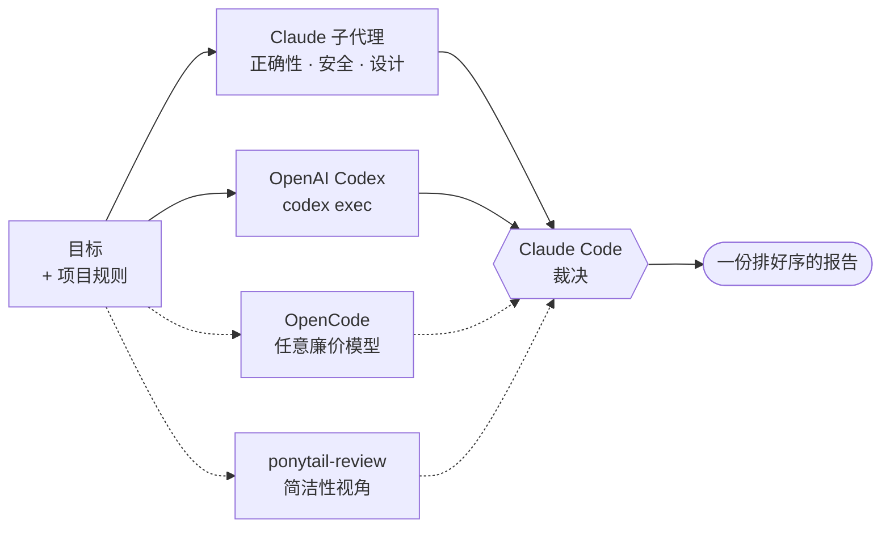

# Multi Code Review (`mcr`)

[English →](README.md) · [Русская версия →](README.ru.md)

## Human Readable

本插件用 2–3 个模型做代码审查，外加
[ponytail-review](https://github.com/DietrichGebert/ponytail) 这个"简洁性"视角。

**审查对象由你指定** —— 一份 diff、一个分支、几个文件、一个函数、一个多年没人碰
的遗留模块、整个仓库都行。不给参数就是"刚才做的这份工作"。

以下几路立刻并行启动，因为它们每次运行都不额外花钱：

- **Codex** —— 无头运行，后台
- **OpenCode** —— 无头运行，审查要求写在提示词里，后台
- **ponytail** —— 简洁性视角，装了就一直开着

等它们报回来之后，Claude 再决定在此之上投入多少**自己的**审查子代理 —— 依据是
免费那几路真正发现了什么，而不是审查开始前的一个猜测。

所有人拿到的是**同一个目标和同一套项目规则** —— 你的 `CLAUDE.md`、`AGENTS.md`，
以及 `.claude/rules/*.md` 里与本次审查相符的那些文件。

最后主代理收齐所有人的结论，逐条核实只有一方提出的问题，剔除误报，交给你一份
报告。

你也可以直接写想查什么 —— `/mcr:multi-review 查一下迁移脚本，那里肯定有竞态`。
这段文字会原样发给三位审查者。

OpenCode 的模型可配置，Codex 的 effort 也可配置。Claude 这边没有 effort 旋钮，
但子代理用哪个模型可以由参数指定：默认 Sonnet，模式决定启动几个。

**安装** —— 三选一：

```bash
# Claude Code 插件市场 —— 完整功能
claude plugin marketplace add szarkans/multi-code-review
claude plugin install mcr@szarkans-skills

# npx skills —— 只装 skill，任何能读 SKILL.md 的代理都能用
npx skills add szarkans/multi-code-review

# 克隆进 skills 目录 —— 完整功能，自动加载，改起来最方便
git clone https://github.com/szarkans/multi-code-review ~/.claude/skills/mcr
```

重启 Claude Code，然后执行 `/mcr:multi-review`（走 npx 安装的话是
`/multi-review`）。npx 这条路会带上 skill 和它的脚本，但不包含审查子代理 ——
子代理属于插件层面的组件，所以那条路下 Claude 这一侧会退回到通用子代理。

Codex 必须已安装并登录（`codex login`）—— 没有它插件会直接停下，而不是假装自己
还是多模型审查。OpenCode 和 ponytail 都是可选的，缺了就跳过。

---

## AI Generated README

> 多个模型看同一份代码、同一套项目规则，再由 Claude Code 裁决，汇成一份排好序的报告。

一个模型审代码，会编造不存在的问题，也会对真问题视而不见。相互独立的模型会意见
不一 —— 而分歧恰恰是最有价值的部分。`mcr` 让至多三位审查者读同一份 diff，把只有
一方提出的结论逐条核实，站不住的丢掉，最后按轻重缓急给你一份报告。



Codex、OpenCode 和 ponytail 视角每次运行都不额外花钱，所以总是立刻并行启动。在
此之上投入多少 Claude，是在它们报回来**之后**才决定的 —— 依据是它们真正发现了
什么，而不是开始前的猜测。虚线表示没装时会被跳过的那几路。

审查者只**提出意见**。他们不投票，也没有最终发言权 —— Claude Code 会去读被引用的代码
然后自己判断。三位里有两位又便宜又在外部跑，所以你的 Claude 预算花在裁决上，而不
是花在通读代码上。

### 与单模型审查的区别

- **每位审查者都拿到项目规则。** `CLAUDE.md`、`AGENTS.md`，以及与改动路径相符的
  `.claude/rules/*.md`，会被收集起来注入给三方。不了解你们约定的外部审查者，会把
  产出浪费在重新争论早已定下的事情上 —— 这里不会。
- **只有一方提出的结论会先对着真实代码核实**，然后你才看得到：打开被引用的行，找
  那个据说缺失的保护，再由 `git` 判断问题是新引入的还是本来就在。
- **分歧被摆到台面上，而不是取平均。** 优秀审查者产生分歧的地方，正是你该细看的
  地方。
- **缺席的审查者会被如实点名**，不会悄悄消失。

### 安装

| 方式 | 得到什么 | 命令 |
|---|---|---|
| Claude Code 插件市场 | skill + 审查子代理 | `claude plugin marketplace add szarkans/multi-code-review`，然后 `claude plugin install mcr@szarkans-skills` |
| [`npx skills`](https://github.com/vercel-labs/skills) | 只有 skill 和脚本 | `npx skills add szarkans/multi-code-review` |
| git clone | skill + 审查子代理，自动加载，最好改 | `git clone https://github.com/szarkans/multi-code-review ~/.claude/skills/mcr` |

子代理属于插件层面的组件，所以走 `npx skills` 时 Claude 这一侧会退回到通用子代理。
其余部分 —— 探测、Codex、OpenCode、项目规则注入、裁决 —— 完全一致，因为脚本就放在
skill 内部。

### 前置条件

| | | |
|---|---|---|
| **Claude Code** | 必需 | 裁决者，以及子代理审查者。 |
| **[OpenAI Codex CLI](https://github.com/openai/codex)** | **必需** | 第二个模型。必须已安装并登录（`codex login`）。没有它就谈不上多模型审查，此时 skill 会停下，而不是假装。 |
| **[OpenCode](https://opencode.ai)** | 可选 | 第三个审查者槽位 —— 你手上任何模型都行。缺失或跑不通就跳过并注明。 |
| **[ponytail](https://github.com/DietrichGebert/ponytail)** | 建议装 | 一个*视角*，不是第四位审查者：`ponytail-review` 只盯过度设计，装了就每次审查都跑。风格口味归它管，所以查缺陷的审查者被明确要求不要碰那块。它的结论单列一节，绝不与 bug 混在一起。 |

可用性由一个 shell 脚本探测，其输出在模型读到 skill 之前就被注入进去，所以这次
检查不花 token，也不保存任何状态。

### 用法

```
/mcr:multi-review                              # 刚才做的这份工作
/mcr:multi-review src/auth.py src/session.py   # 两个文件，完全不涉及 diff
/mcr:multi-review 遗留的计费模块                # 老代码，整个都在范围内
/mcr:multi-review 这个分支对比 main             # 改动审查
/mcr:multi-review ultra                        # 任务到底做完了没有？
```

走 `npx skills` 安装时命令是 `/multi-review`。

**命令后面全是自由文本，剩下的部分就是给审查者的指令。** 少数几个 token 会被识别
并摘出来，其余内容原样交给三位审查者，并在报告开头得到回答。

```
/mcr:multi-review 查一下迁移脚本，那里肯定有竞态
/mcr:multi-review ultra is the retry idempotent? what happens on a double webhook
/mcr:multi-review high 只看安全问题
/mcr:multi-review check src/auth.py and src/session.py
```

只要点到真实存在的文件或目录，diff 本身就会收窄到它们，于是所有审查者和项目规则
收集看到的是同一段更小的范围。

会被识别的 token，全部可选，按取值而非按位置：

| | |
|---|---|
| `haiku` `sonnet` `opus` `fable` | Claude 审查子代理用的模型 |
| `low` `medium` `high` `xhigh` `max` | Codex 的推理 effort |
| `lite` `normal` `ultra` | 深度 |

```
/mcr:multi-review opus max ultra
```

指定了模式就跳过升级判断，直接按它来。

你直接说要做审查、想要第二意见、或者提 PR 前想交叉验证时，Claude 也会自己调用它。

#### 模式

Codex、OpenCode 和 ponytail 在所有模式下都跑 —— 它们是免费的，压着不放没有任何
好处。模式只决定在此之上投入多少 **Claude**，而且它不是提前选的：先由免费的那几
路报回来，深度再从它们的发现里推出来。

| 模式 | Claude 子代理 | 什么时候 |
|---|---|---|
| `lite` | 正确性 | 小、风险低，且免费那几路一致认为没什么东西 |
| `normal` *(默认)* | 正确性 · 安全 · 设计 | 任何要进 PR 的东西 |
| `ultra` | 以上三个，再加**执行**，再加第二遍对抗式 Codex，再给每条单一来源结论配一个核实者 | 搞砸了代价很大 |

`ultra` 不是更深的代码审查，它审查的是**任务到底做完了没有**：有没有计划、有没有
照着做、是真做完了还是只是看着像做完了、什么被悄悄跳过了、什么以后会爆。这需要任
务上下文，所以它最适合紧接着干完活时用；没有计划可对照时，它会直说。

> 如果 ponytail 模式处于激活状态，它的 `SubagentStart` 钩子会把 YAGNI 规则注入
> **每一个**子代理，包括那些专门找 bug 的。把 `PONYTAIL_SUBAGENT_MATCHER` 设成一个
> 匹配不到 `mcr-` 的正则，可以让缺陷审查者保持中立。

#### 配置

| 变量 | 作用 |
|---|---|
| `MCR_OPENCODE_MODEL` | 固定第三位审查者的模型，例如 `opencode/deepseek-v4-flash-free`。 |
| `MCR_OPENCODE_CANDIDATES` | 上一项未设置时，从这个空格分隔的列表里自动挑一个。 |
| `MCR_CONTEXT_MAX_BYTES` | 注入的项目规则上限（默认 24000）。 |
| `MCR_REVIEWER_MODEL` | Claude 审查子代理用的模型。默认 Sonnet —— 一群审查者不是该砸贵模型的地方，深度的回报在裁决那一步。没有任何模式会自行提高它。 |

默认只出报告：不改代码、不提交、不写 PR 评论。另有一个需显式开启的循环模式，会一
边修一边重审，直到不再出现新问题，最多三轮。

### 如何评估它

`evals/` 下有一套查全率测试台。每个用例指向一个真实的修复提交；运行器把仓库切到
该提交，然后**只把源码文件回退**到修复前 —— 于是被审查的 diff 就是*把 bug 引入*
的那一笔，而测试和文档仍停在修好的状态、且不进入 diff —— 再让外部审查者跑一遍。

```bash
evals/run.sh --repo ~/dev/some-repo --out /tmp/mcr-eval
```

评分刻意不做自动化：「它有没有找到*这个*bug」是一个判断题，用子串匹配两个方向都会
判错。

这套方法有个已知局限：回退修复，等于把一处保护被**删掉**摆在审查者面前，而这比发现
一处从来没写过的保护要容易得多。这里分数高只能证明流水线是通的，并不能衡量这些模型
面对新写的代码时表现如何。

## 许可证

MIT © Sergei Shatrov
